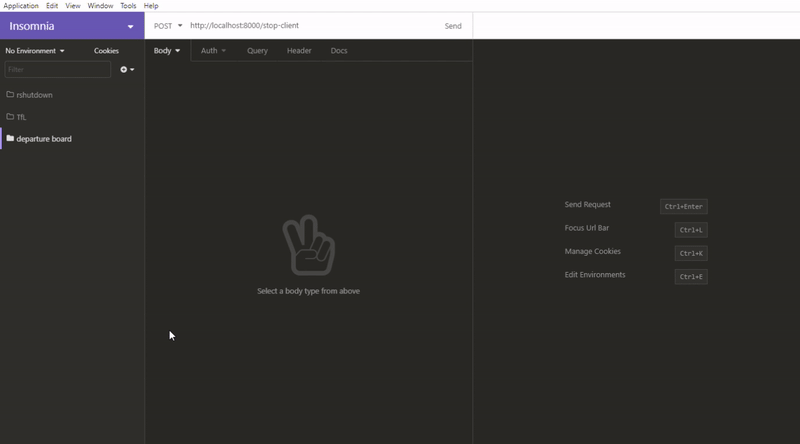
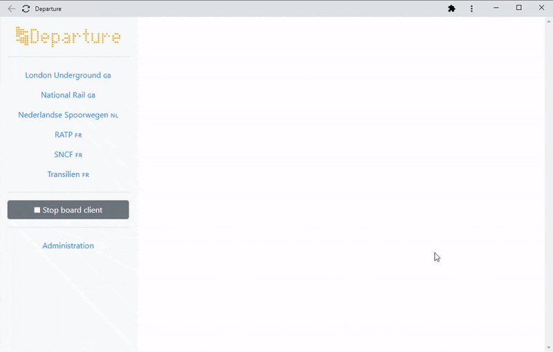

This is the documentation for the Python Departure package.


## Prerequisites

Get API keys for transport operators. **TODO**

Install Python.

(Optional, recommended) create a Python virtual environment.


## Installation

Set environment variables with API keys for public transport operators. **TODO**

Install Python package.


```
$ pip install departure
```

  

## Usage

There are three command line interface tools:

- `departure`, the main CLI, to get station information and departures from public transport operators, and update a virtual or physical departure board with departure information for a station,
- `departure-web`, to run the API web server,
- `departure-server`, to run a Python departure board server.


### Main CLI

To get started, display the main CLI's help page.

```
$ departure
```


The following command searches for SNCF (FR) stations containing "Paris".

```
$ departure sncf search paris
```


The following command shows the next departures at Den Haag Centraal (NL).

```
$ departure ns next gvc
```


The following command shows the next Westbound departures on Central Line at Oxford Circus.

```
$ departure lu next ce oxc w
```


The following command updates a departure board with SNCF (FR) departures at Paris Montparnasse.

```
$ departure sncf board 87391003
```

The `departure <operator> board` commands require a running a Departure board server on a physical or virtual departure board – see below for Python Departure board servers and https://github.com/spujadas/departure-board-servers-cpp for C++ Departure board servers.


### Web API server

To start the Departure web API server:

```
$ departure-web
```

The server will run on port 8000, e.g. if installed locally browse to http://localhost:8000.


The OpenAPI documentation can be found at `/docs`, e.g. http://localhost:8000/docs.


Here is a sample cURL command to update a board, in this case with departure information for Montparnasse SNCF station (FR):

```
$ curl -X POST http://localhost:8000/sncf/start-client -d "{\"stop_area_id\": \"87391003\"}"
```


Alternatively, you can use a REST GUI client, such as [Insomnia](https://insomnia.rest/) (shown below) or [Postman](https://www.postman.com/).




To use the Departure web front end, clone or download the [Departure front end](https://github.com/spujadas/departure-front-end) repository to any directory, point the `DEPARTURE_STATIC_WEBROOT` environment variable to this directory, and start the web API server (`departure-web`), then browse to the server on port 8000, e.g. http://localhost:8000.




### Departure board server

To run a Python Departure board server on a virtual or physical departure board, you will first need to install one or several [Python back ends](https://github.com/spujadas/departure-board-servers-python).

Run the following command to list the available back ends.

```
$ departure-server
```


## About

Written by [Sébastien Pujadas](https://pujadas.net/), released under the [MIT license](https://github.com/spujadas/departure-python/blob/master/LICENSE).

All product names, logos, and brands are property of their respective owners. All company, product and service names used in this project are for identification purposes only. Use of these names, logos, and brands does not imply endorsement.

